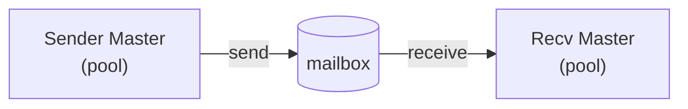

# Doll 3 — Pool — Deep Dive

> See [Quick Reference](block3_quickref.md) for API signatures and contracts.
>
> **Prerequisite:** [Doll 1](block1_quickref.md) + [Doll 2](block2_quickref.md).

---

## Safety: Handle Validation

All pool operations (`pool_init`, `pool_get`, `pool_get_wait`, `pool_put`, `pool_put_all`, `pool_close`) validate the `Pool` handle. If the `PolyNode.tag` is not `POOL_TAG`, the operation will `panic` immediately. This prevents accidentally using a data item or a mailbox as a pool.

---

## Recycler — from Builder to hooks

You already have Builder from Doll 1.
Builder creates and destroys by tag.

Recycler extends that idea.
Recycler adds:

- **Reuse** — reinitialize instead of destroy + create.
- **Policy** — decide whether to keep or drop.

The same creation and destruction logic from Builder lives in `on_get` and `on_put`.

---

## Hook examples

```odin
@(private) chunk_tag:    PolyTag = {}
@(private) progress_tag: PolyTag = {}
CHUNK_TAG:    rawptr = &chunk_tag
PROGRESS_TAG: rawptr = &progress_tag

chunk_is_it_you    :: #force_inline proc(tag: rawptr) -> bool { return tag == CHUNK_TAG }
progress_is_it_you :: #force_inline proc(tag: rawptr) -> bool { return tag == PROGRESS_TAG }

master_on_get :: proc(ctx: rawptr, tag: rawptr, in_pool_count: int, m: ^MayItem) {
    master := (^Master)(ctx)
    if m^ == nil {
        // no item available — create new one using master.alloc
        if chunk_is_it_you(tag) {
            c := new(Chunk, master.alloc)
            c.tag = CHUNK_TAG
            m^ = (^PolyNode)(c)
        } else if progress_is_it_you(tag) {
            p := new(Progress, master.alloc)
            p.tag = PROGRESS_TAG
            m^ = (^PolyNode)(p)
        }
    } else {
        // recycled item — reinitialize using master fields
        ptr, ok := m^.?
        if !ok { return }
        if chunk_is_it_you(ptr.tag) {
            (^Chunk)(ptr).len = 0
        } else if progress_is_it_you(ptr.tag) {
            (^Progress)(ptr).percent = 0
        }
    }
}

master_on_put :: proc(ctx: rawptr, in_pool_count: int, m: ^MayItem) {
    master := (^Master)(ctx)
    if m == nil || m^ == nil { return }
    ptr, ok := m^.?
    if !ok { return }
    if chunk_is_it_you(ptr.tag) {
        if in_pool_count > 400 {
            free((^Chunk)(ptr), master.alloc)
            m^ = nil  // dispose — pool will not store
        }
    } else if progress_is_it_you(ptr.tag) {
        if in_pool_count > 128 {
            free((^Progress)(ptr), master.alloc)
            m^ = nil  // dispose — pool will not store
        }
    }
    // m^ still non-nil here → pool stores it
}
```

---

## Standalone Recycler use

Recycler without Pool is valid.
It is Builder with policy.
User calls `on_get` and `on_put` directly.
User decides keep or drop without pool storage.

---

## Why panic on unknown tag?

A foreign tag on `pool_put` is almost always a bug:

- wrong cast earlier
- wrong pool
- memory corruption
- use-after-free

Silent recycling would create silent leaks or use-after-free later.
A loud panic during development is better than hunting ghosts in production.

Nil is always invalid because it is the zero value of `rawptr`.
An uninitialized `PolyNode` would have `tag == nil`.
Panicking on nil catches missing initialization immediately.

---

## Setup example

```odin
@(private) chunk_tag:    PolyTag = {}
@(private) progress_tag: PolyTag = {}
CHUNK_TAG:    rawptr = &chunk_tag
PROGRESS_TAG: rawptr = &progress_tag

// Setup: populate hooks.tags before pool_init
append(&hooks.tags, CHUNK_TAG)
append(&hooks.tags, PROGRESS_TAG)
p := pool_new(alloc)
pool_init(p, &hooks)
```

---

## Master with Pool — extending Doll 2's Master

In Doll 2, Master held Builder and mailbox references.
Now Master holds Pool and Recycler (PoolHooks) too.

Builder from Doll 1 becomes the basis for your hooks.
The same creation and destruction logic lives in `on_get` and `on_put`.

```odin
Master :: struct {
    pool:  Pool,
    hooks: PoolHooks,
    inbox: Mailbox,
    alloc: mem.Allocator,
    // ... other state ...
}

newMaster :: proc(alloc: mem.Allocator) -> ^Master {
    m := new(Master, alloc)
    m.alloc = alloc
    m.hooks = PoolHooks{
        ctx    = m,
        on_get = master_on_get,
        on_put = master_on_put,
    }
    append(&m.hooks.tags, CHUNK_TAG)
    append(&m.hooks.tags, PROGRESS_TAG)

    m.pool = pool_new(alloc)
    pool_init(m.pool, &m.hooks)
    m.inbox = mbox_new(alloc)
    return m
}

freeMaster :: proc(master: ^Master) {
    // Required order: close → process remaining → dispose → free ctx (master).
    // Freeing master before pool_close causes use-after-free in hooks.

    // 1. close pool — get back stored items
    nodes, _ := pool_close(master.pool)

    // 2. process remaining and dispose all returned items
    // NOTE: dispose nodes before freeing other Master resources.
    for {
        raw := list.pop_front(&nodes)
        if raw == nil { break }
        // dispose node — master knows how
    }

    // 3. teardown pool
    m_pool: MayItem = (^PolyNode)(master.pool)
    matryoshka_dispose(&m_pool)

    // 4. close and process remaining mailbox
    remaining := mbox_close(master.inbox)
    // process remaining remaining...

    // 5. teardown mailbox
    m_mb: MayItem = (^PolyNode)(master.inbox)
    matryoshka_dispose(&m_mb)

    // 6. delete tags dynamic array (user-owned)
    delete(master.hooks.tags)

    // 7. free Master last — save alloc first
    alloc := master.alloc
    free(master, alloc)
}
```

Pool borrows hooks — pointer, not copy.
`freeMaster` owns the full teardown.

---

## Pre-allocating (Seeding the Pool)

To avoid runtime latency, pre-allocate before starting Masters:

```odin
master := newMaster(context.allocator)

for _ in 0..<100 {
    m: MayItem
    if pool_get(master.pool, CHUNK_TAG, .New_Only, &m) == .Ok {
        pool_put(master.pool, &m)  // put back immediately — goes to free-list
    }
}
```

`New_Only` always calls `on_get` with `m^==nil`, forcing creation even when items are stored.

---

## Pool Get Modes — examples

Mode is a per-call parameter of `pool_get`.
Not a pool-wide setting.

```odin
// Normal operation — use stored item if available, create if not
pool_get(master.pool, CHUNK_TAG, .Available_Or_New, &m)

// Force creation — use for seeding or when you want a guaranteed fresh item
pool_get(master.pool, CHUNK_TAG, .New_Only, &m)

// Stored only — use in no-alloc paths
// Returns .Not_Available if no item stored — on_get not called
if pool_get(master.pool, CHUNK_TAG, .Available_Only, &m) != .Ok {
    // no item stored — handle: skip, back off, or call pool_get_wait
}
```

---

## Patterns

### Builder to Pool — simplest upgrade from Doll 2

Replace Builder.ctor/dtor calls with pool_get/pool_put.
Same patterns, now with recycling.

Doll 2 sender:
```odin
m := ctor(&b, CHUNK_TAG)
// fill
mbox_send(mb, &m)
```

Doll 3 sender:
```odin
m: MayItem
defer pool_put(p, &m)  // [itc: defer-put-early]
if pool_get(p, CHUNK_TAG, .Available_Or_New, &m) != .Ok {
    return
}
// fill
mbox_send(mb, &m)
// m^ is nil after send — defer pool_put is a no-op
```

---

### Backpressure

`on_put` checks `in_pool_count`.
Too many idle items → dispose.

```odin
// in master_on_put:
ptr, ok := m^.?
if !ok { return }
if chunk_is_it_you(ptr.tag) && in_pool_count > 400 {
    free((^Chunk)(ptr), master.alloc)
    m^ = nil  // dispose — pool will not store
}
```

Start simple.
Add limits when it hurts.

---

### Full lifecycle with mailbox



**Setup:**
```odin
master := newMaster(context.allocator)
defer freeMaster(master)
```

**Sender Master:**
```odin
m: MayItem
defer pool_put(master.pool, &m)  // [itc: defer-put-early]

if pool_get(master.pool, CHUNK_TAG, .Available_Or_New, &m) != .Ok {
    return
}

// fill
ptr, ok := m.?
if !ok { return }
c := (^Chunk)(ptr)
c.len = fill(c.data[:])

// transfer
if mbox_send(mb, &m) != .Ok {
    return  // send failed — defer pool_put recycles
}
// m^ is nil — transfer done — defer pool_put is a no-op
```

**Receiver Master:**
```odin
m: MayItem
defer pool_put(master.pool, &m)  // safety net

if mbox_wait_receive(mb, &m) != .Ok {
    return
}

ptr, ok := m.?
if !ok { return }

if chunk_is_it_you(ptr.tag) {
    c := (^Chunk)(ptr)
    process_chunk(c)
    pool_put(master.pool, &m)    // explicit return — defer is no-op
} else if progress_is_it_you(ptr.tag) {
    pr := (^Progress)(ptr)
    update_progress(pr)
    pool_put(master.pool, &m)    // explicit return — defer is no-op
}
```

**Why both `defer pool_put` and per-case `pool_put`?**

- Per-case `pool_put` is the normal path — it sets `m^ = nil`.
- After that, the deferred `pool_put` runs and sees `m^ == nil` — becomes a no-op.
- The `defer` is a safety net for paths you did not anticipate.
- Belt and suspenders — intentional.

**Shutdown:**
```odin
remaining := mbox_close(mb)

for {
    raw := list.pop_front(&remaining)
    if raw == nil { break }
    poly := (^PolyNode)(raw)
    polynode_reset(poly)        // required: batch pop does not reset
    m: MayItem = poly
    pool_put(master.pool, &m)
    if m^ != nil {
        // pool was already closed — dispose manually
    }
}

freeMaster(master)
```

---

## What you can build with all three layers

- Compression pipeline — chunks flow from reader Master to worker Masters and back, recycled through Pool.
- Game engine — entities, bullets, particles allocated from Pool, dispatched across Masters, recycled on death.
- Network server — request buffers from Pool, dispatched to handler Masters, response buffers returned to Pool.
- Streaming processor — data flows through a chain of Masters, Pool absorbs allocation spikes.

Same vocabulary at every level: get → fill → send → receive → put back.
Only the hooks grow when you need control.
